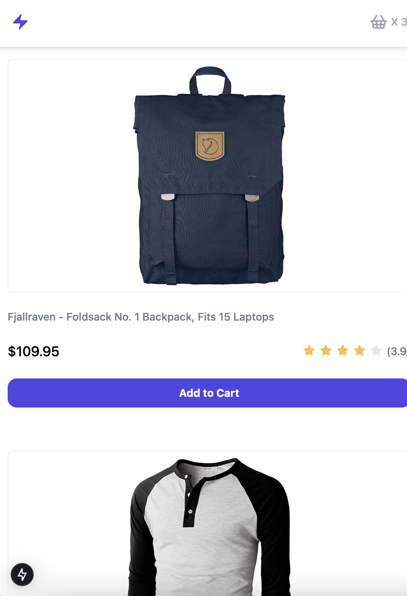
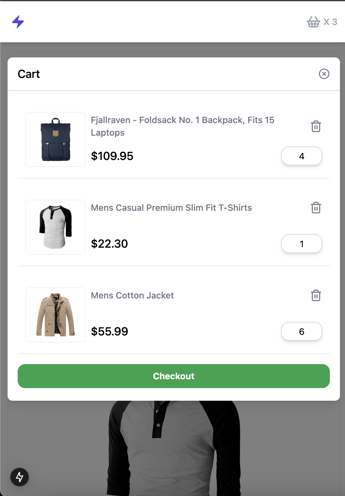
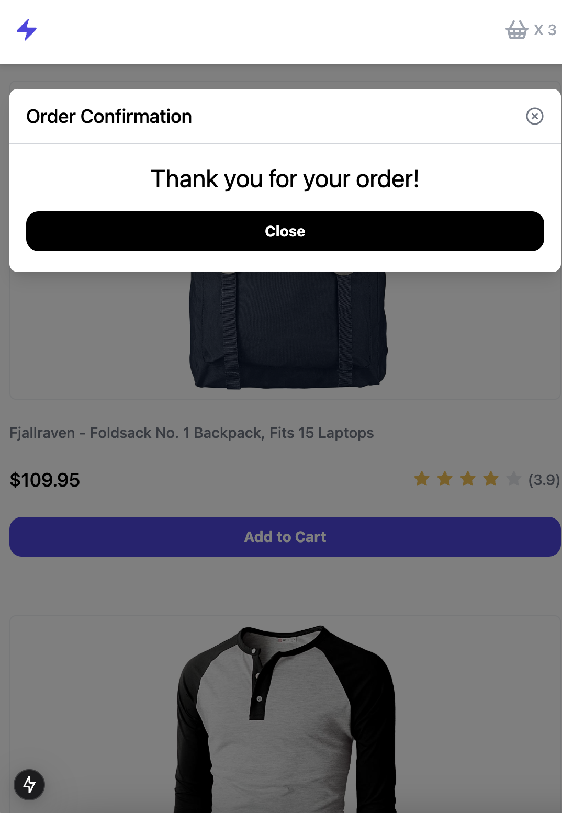
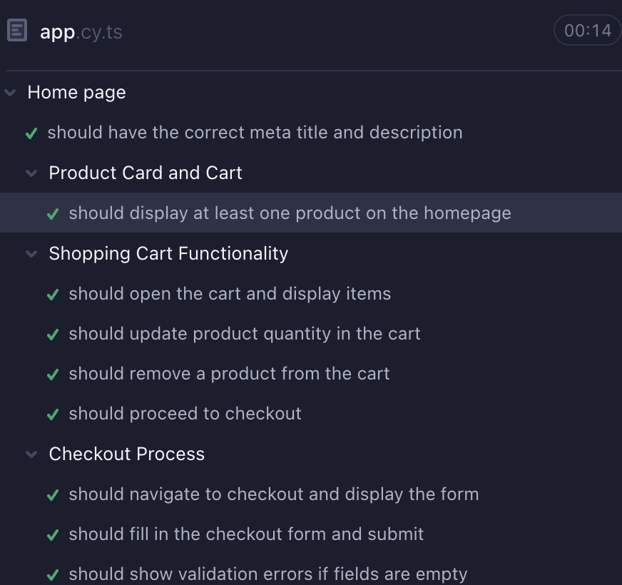
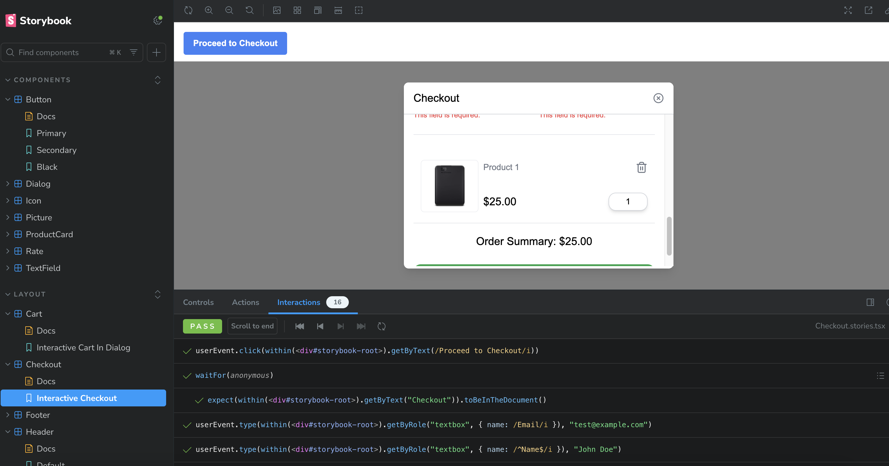
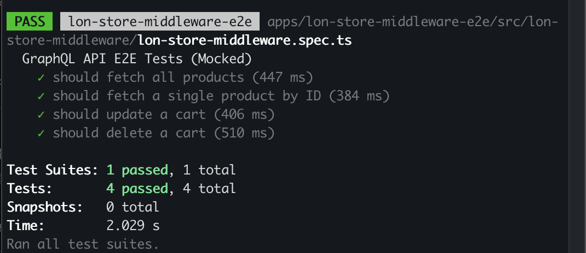
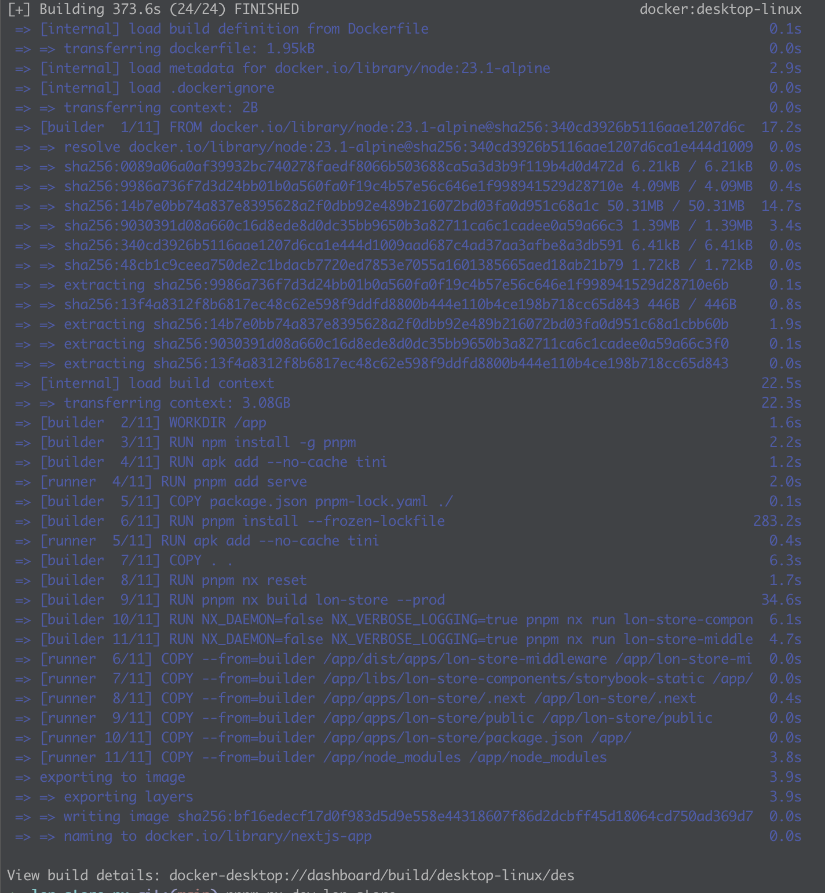

# Overview

This project adopts the **Nx.js Monorepo** structure to enhance code management and build efficiency. It integrates **Storybook** for UI component development, providing a visual component library and automated documentation. Additionally, it utilizes **Next.js App Router** for modern frontend routing, optimizing performance and SEO. Furthermore, **Tailwind CSS** is used for styling, improving development efficiency, reducing CSS redundancy, and offering flexible responsive design capabilities.

# Runtime Environment

This project uses **Node.js 23.0.1** and consists of four applications and one library:

## Applications (apps directory)

- **lon-store**: A Next.js-based frontend application.
- **lon-store-e2e**: An end-to-end testing application using Cypress.
- **lon-store-middleware**: A backend service based on Express.
- **lon-store-middleware-e2e**: A backend testing application using Jest.

## Library (libs directory)

- **lon-store-components**: A shared component library using Storybook for UI component development and management.

# How to Run

## 1. Install Dependencies

```sh
pnpm install
pnpm install --filter lon-store
pnpm install --filter lon-store-e2e
pnpm install --filter lon-store-components
pnpm install --filter lon-store-middleware
pnpm install --filter lon-store-middleware-e2e
```

## 2. Run

### lon-store

- **Development Mode**

  ```sh
  pnpm nx run lon-store:dev
  ```

- **Deployment Mode**

  ```sh
  pnpm nx run lon-store:build & pnpm nx run lon-store:start
  ```
    
    
    
    

### lon-store-e2e

- **Run Cypress**

  ```sh
  pnpm nx run lon-store-e2e:open-cypress
  ```

   

### lon-store-components

- **Run Storybook**

  ```sh
  pnpm nx run lon-store-components:storybook
  ```
  

### lon-store-middleware

- **Run API Service**

  ```sh
  pnpm nx run lon-store-middleware:serve
  ```
### lon-store-middleware-e2e

- **Run E2E Tests**

  ```sh
  pnpm nx run lon-store-middleware-e2e:e2e
  ```
  

# Deployment

**Run In Docker**
```sh
  docker build -t lon-store-image .
  docker run -p 3000:3000 -p 4000:4000 -p 6006:6006 --name lon-store-instance lon-store-image:latest
  ```
  note:Expose ports 3000:lon-store 4000:lon-store-middleware 6006:lon-store-components

  

# Outstanding Issues

1. The exact same icon as the shopping cart design could not be found, so a different icon was used as a replacement.
2. Currently, mock API updates and deletions are not reflected in the query list, so update effects are not visible.
3. Multi-environment deployment CI/CD still requires some time to complete.
